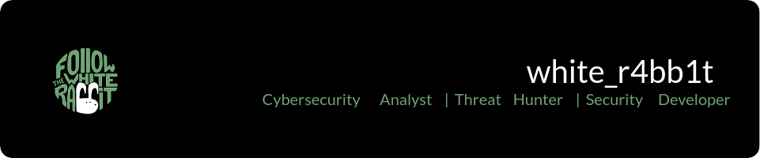

<h1>👋 Hi there! I'm Cristián Gutiérrez, a cybersecurity professional bridging the gap between technical security and business impact .</h1>

I'm a cybersecurity professional with experience combining deep technical expertise with strategic business vision. Currently specializing in threat hunting, SIEM analysis, and security automation while pursuing advanced certifications in penetration testing.

<h2>⚡️ Where to find me</h2>

